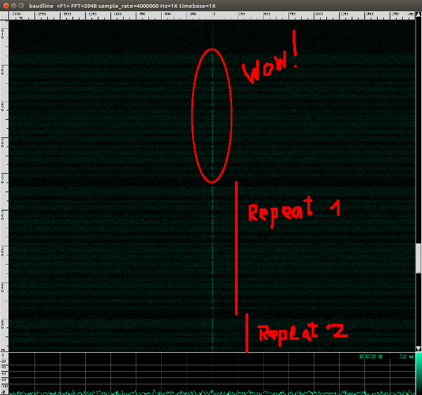

Wireless Massage Egg Remote Control
===================================

Control wireless massage eggs with your SDR.


The System
----------

This is what an egg and the remote look like.  
[](pics/egg-and-remote.png)


It uses simple ASK/OOK. For example, pushing the *up* button produces a signal  like this:  
[](pics/ook-signal.png)


Requirements
------------

* A working installation of GnuRadio.
  This project was created with GNU Radio Companion 3.7.8.
* A Software Defined Radio (e.g. HackRF, rad1o, USRP, RTL-SDR, etc.)
  This project was tested with the [rad1o](https://rad1o.badge.events.ccc.de/) SDR.
* An antenna suitable for the 433 ISM band.


Configure the Software
----------------------

I got the best results when setting the channel frequency to 433.85 MHz.
You can set the channel frequency by editing the `channel_freq` variable
in the GnuRadio flow graph (.grc files). Also you can switch the SDR
source/sink (e.g. to UHD).

Don't forget to delete the `wme_tx_gr.py`. A new version of this files
will be generated which will include the changes made in the GnuRadio flow graph.


Controlling Eggs
----------------

You can control an egg using the `wme_tx.py` script.
On the original remote there are tree buttons. *Up*, *down* and *off*.
To turn on an egg an *up* command must be send. 

```
$ ./wme_tx.py -h
usage: wme_tx.py [-h] [-g] [-r REPEAT] -c COMMAND

optional arguments:
  -h, --help            show this help message and exit
  -g, --grcoutput       Show the output of gnuradio/grcc.
  -r REPEAT, --repeat REPEAT
                        Repeat every packet REPEAT times. Default is 4.
  -c COMMAND, --command COMMAND
                        Remote control command. Commands are 'up', 'down' or
                        'off'. Use 'up' to turn it on.
```

Example (turn on an egg):
```
$ ./wme_tx.py -c up
[+] Create FIFO file to communicate with gnuradio.
[+] Launch gnuradio script to send packages from the FIFO file.
[-] gnuradio script not found. Creating script from .grc file.
[+] Wait 1 second for gnuradio to boot up.
[+] Every packet will be repeated 4 times.
[+] Sending packets... This will take about 0.672 seconds.
[+] Wait 1 second before terminating gnuradio.
[+] Terminate gnuradio.
[+] Remove fifo file.
[+] Exit.
```
